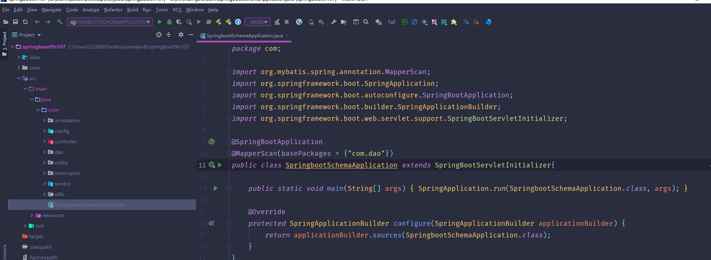
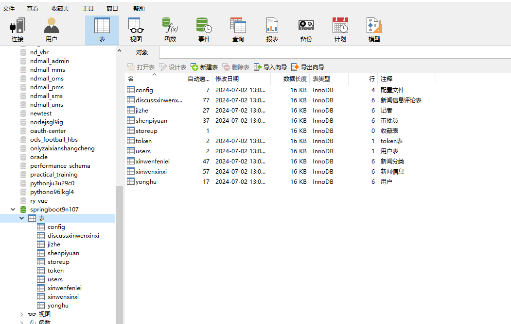
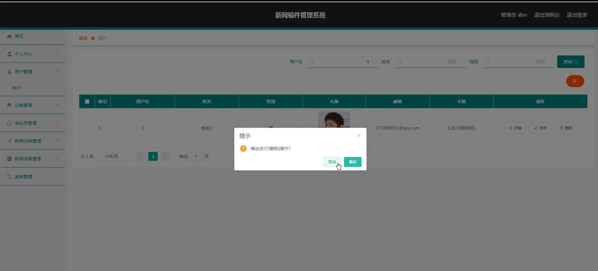
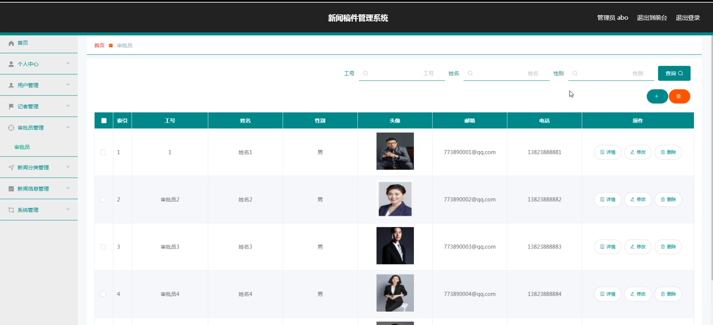
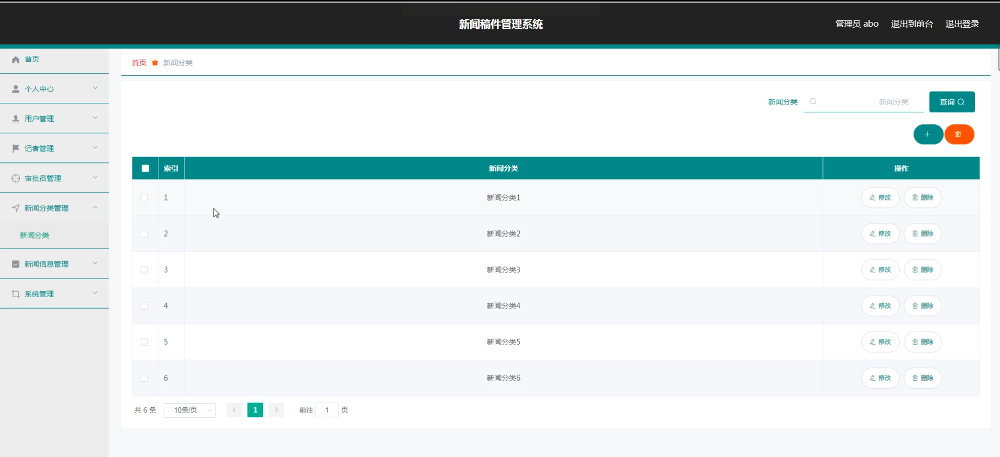
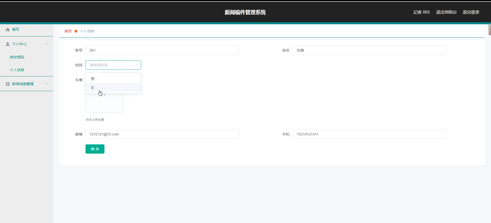
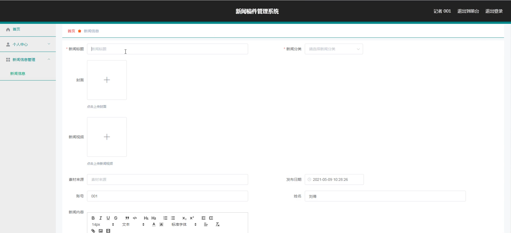
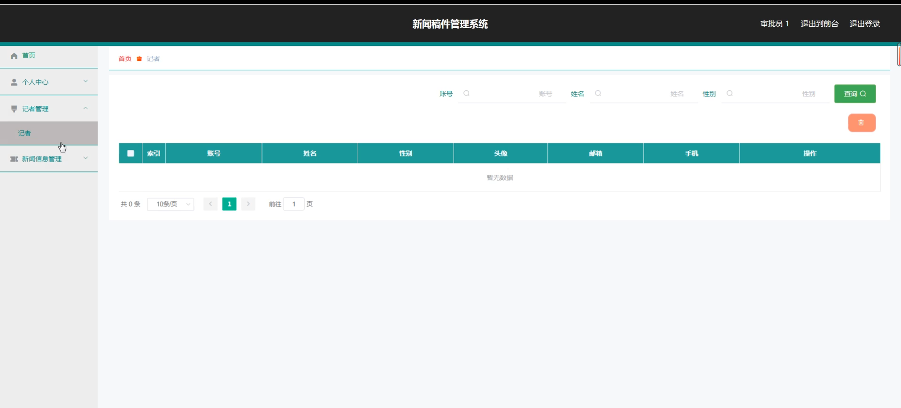
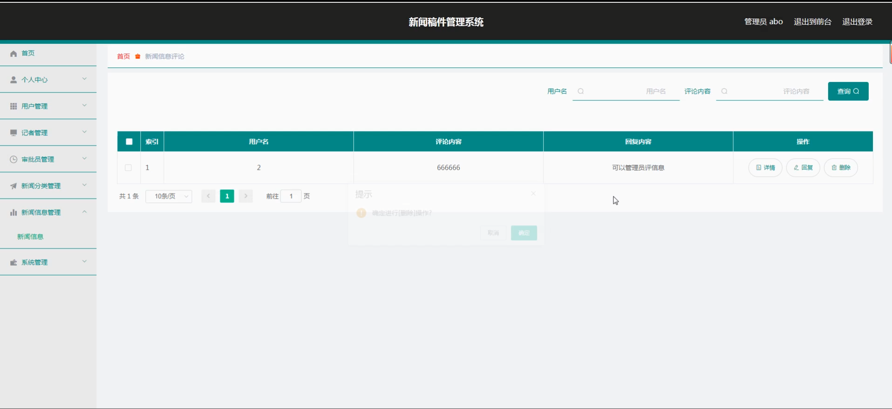
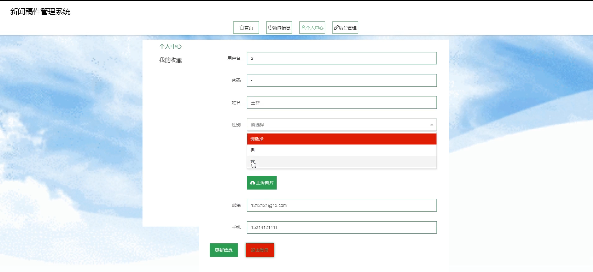

# 基于springboot的新闻稿件管理系统

<h4 style='color:red'>联系不到我，就看我的主页 </h4> 
 
#### 介绍

基于SpringBoot的新闻稿件管理系统旨在为新闻机构提供一个高效、便捷的新闻稿件管理平台。该系统涵盖了管理端、记者端和审批员端三个角色，各角色具有相应的功能模块，实现了新闻稿件的提交、审核和发布流程的全流程管理。系统通过信息化手段，提高了新闻稿件管理的效率和透明度，保障了新闻发布的及时性和准确性。

#### 技术栈

后端技术栈：Springboot+Mysql+Maven

前端技术栈：Vue+Html+Css+Javascript+ElementUI

开发工具：Idea+Vscode+Navicate

#### 系统功能介绍

管理端功能模块  
个人中心：管理员可以管理个人信息，修改密码等。  
用户管理：管理系统中所有用户的基本信息，包括添加、删除和更新用户信息。  
记者管理：管理记者的基本信息，包括添加、删除和更新记者信息。  
审批员管理：管理审批员的基本信息，包括添加、删除和更新审批员信息。  
新闻信息管理：管理新闻稿件的基本信息，包括录入、编辑、删除和查看新闻稿件。  
系统管理：对系统进行整体管理与维护，包括系统配置、权限设置等。  

记者端功能模块  
首页：记者可以在首页查看最新的新闻动态和系统通知。  
新闻信息：记者可以查看所有新闻稿件的详细信息。  
个人中心：记者可以管理个人信息，修改密码等。  
后台管理：  
新闻信息管理：记者可以录入、编辑和提交新闻稿件。  

审批员端功能模块  
首页：审批员可以在首页查看最新的新闻动态和系统通知。  
新闻信息：审批员可以查看所有新闻稿件的详细信息。  
个人中心：审批员可以管理个人信息，修改密码等。  
后台管理：  
新闻信息管理：审批员可以审核、编辑和批准新闻稿件。  

#### 系统作用

简化新闻稿件管理流程：系统将传统的新闻稿件管理流程线上化，减少了纸质文件的使用，提高了新闻稿件的提交、审核和发布效率。  
提高管理效率：通过信息化管理，管理员、记者和审批员可以更加高效地进行新闻稿件的录入、审核和发布。  
增强透明度：系统提供了实时的新闻稿件信息，记者和审批员可以随时查看新闻稿件的状态和详细信息，增强了管理的透明度。  
数据统计和分析：系统可以对新闻稿件的提交、审核和发布数据进行统计和分析，帮助新闻机构更好地了解新闻稿件的管理情况，及时发现和解决问题。  
保障新闻发布的及时性和准确性：系统通过流程化管理，确保新闻稿件在规定时间内完成审核和发布，保障了新闻发布的及时性和准确性。  

#### 系统功能截图

代码结构

数据库表

登录

前台页面首页

管理员端用户管理

审批员管理

新闻分类管理

记者端个人信息

新闻信息

审批员端记者管理

新闻信息评论

个人中心

#### 总结

基于SpringBoot的新闻稿件管理系统为新闻机构的稿件管理提供了一个高效、便捷的信息化平台。通过分角色的功能模块设计，满足了不同用户的需求，实现了新闻稿件管理流程的线上化和自动化，提高了管理的效率和透明度。系统不仅简化了新闻稿件的提交和审核流程，还提供了强大的数据统计和分析功能，为新闻机构的新闻管理工作提供了有力支持。

#### 使用说明

创建数据库，执行数据库脚本 修改jdbc数据库连接参数 下载安装maven依赖jar 启动idea中的springboot项目

后台地址：http://localhost:8080/springboot9n107/admin/dist/index.html

管理员  abo 密码 abo

前台地址：http://localhost:8080/springboot9n107/front/index.html

